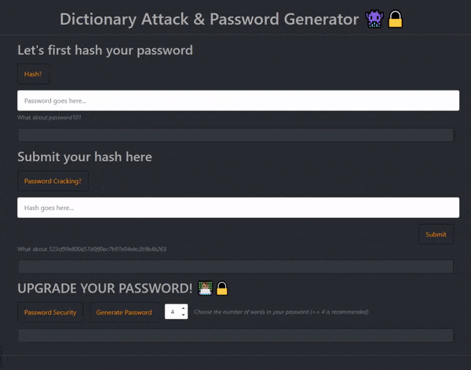

# Password Cracking with Dictionary Attack 👾🔒



Information security is the practice of (literally) _protecting information_, where we seek to prevent or reduce the likelihood of unauthorized/inappropriate access to information systems, whether for illegal use, disclosure, disruption, deletion, corruption, modification, inspection, logging, or downgrading of said system.

[Cyber Security](https://en.wikipedia.org/wiki/Computer_security) is a vast and extremely dynamic field of study, with vulnerabilities, patches, and vulnerabilities about patches being published constantly. Attackers often employ a wide arsenal of attacks to test their targets’ defenses, from [SQL injections](https://en.wikipedia.org/wiki/SQL_injection) and [Cross-site Scripting](https://en.wikipedia.org/wiki/Cross-site_scripting), to [DNS Cache Poisoning](https://en.wikipedia.org/wiki/DNS_spoofing) and [Slowloris attacks](<https://en.wikipedia.org/wiki/Slowloris_(computer_security)>). Thus, organizations must be prudent and cautious when developing their _informational context_.

Perhaps one of the ways (certainly one of the most familiar to all of us) that we can begin to intervene in order to create a _culture of security_, is by improving how "_we secure the keys that assure us_": our `passwords`.

To this end, here you can find a `Password Security` webapp demo. In it you will find information on how certain types of attacks ([Password Cracking](https://en.wikipedia.org/wiki/Password_cracking)) can be managed, which tools attackers use, how to create "_entropically_" secure passwords, and how you can measure your own password security using some tools imported from [Information Theory](https://en.wikipedia.org/wiki/Information_theory). All this can be done interactively by a [Dash](https://plotly.com/dash/) app.

⚠️ This application has been developed for educational purposes only. Passwords and broken hashes have been created for this specific purpose. [SHA-1](https://en.wikipedia.org/wiki/SHA-1) is deprecated and should not be used for security purposes. Using password cracking methods to access your own password is lawful. _Using password cracking methods to gain access to someone else’s password may lead to criminal charges._ ⚠️

## Requirements

```bash

dash
dash-bootstrap-components
dash-daq
pandas

```

## Usage

Simply run the `app.py` script. Auxiliary functions, such as dictionary maintenance (`clean_dictionaty.py`), and individual functions (`cracker_generator.py`) can be found individually.
